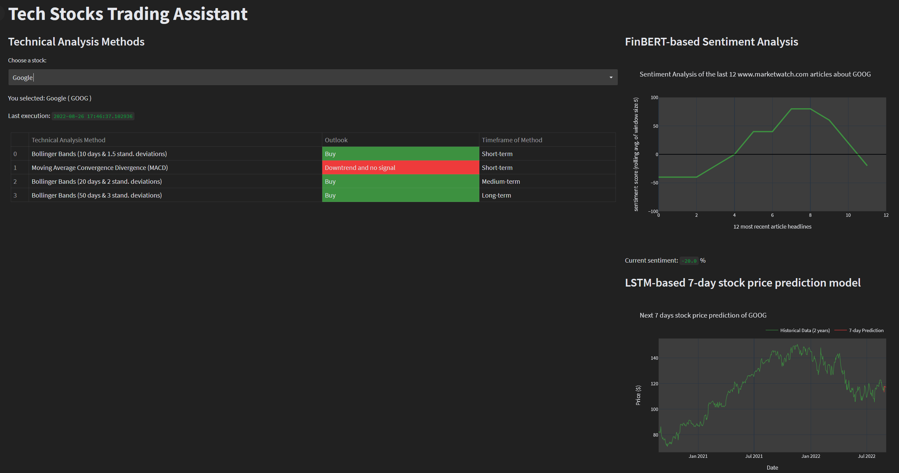

# FinBERT & LSTM-based Tech Stocks Trading Assistant Web App  

## Introduction  

  This project is a simple Streamlit **stock trading assistant** web-app, which includes **3 tools** that can help a trader have more accurate and profitable trades.  
You can try our app here: [App Link in HugginFace Spaces](https://huggingface.co/spaces/IoannisTr/Tech_Stocks_Trading_Assistant)  
An overview of this dashboard-like web app can be seen in the following figure:  
 
  
 
The app-assistant consists of 3 parts-tools:  
1. Stock Headers' of www.marketwatch.com articles sentiment analysis (FinBERT model) 
2. 7-day stock price prediction (LSTM model)
3. Outlooks of four different technical analysis methods for stock trading 
 
When the user chooses a stock from the app's drop-down menu, each of these 3 "tools" will return their "advice"/outlook.  

## FinBERT-based Sentiment Analysis (1st tool)
The 1st tool is the Sentiment Analysis lineplot. When the user chooses a stock, our code scraps the last 17 articles' headlines of this stock from www.marketwatch.com and labels them as either "Positive", "Negative", or "Neutral", which are encoded as scores (+100, 0, -100 correspondingly). As there is no standard way to quantify the sentiment of something, we will use a scale of (-100, +100). It must be noted that even though we get the last 17 articles' headers in each execution, only the last 12 headers' sentiment can be seen in the plot. That is because we use a rolling average with a sliding window of size 5, in order to "smooth" the line.  
 
The model used can be found here: [HuggingFace ProsusAI finbert](https://huggingface.co/ProsusAI/finbert)  
This model is a pre-trained NLP model that can analyze sentiment of financial text and it is built by further training the BERT language model in financial text.  
 
Additionaly, the model was fine-tuned by using the following dataset: [Financial PhraseBank (2014)](https://huggingface.co/datasets/financial_phrasebank).  
This dataset includes 4840 headlines-like sentences about financial news, labeled as either **Positive** or **Negative** or **Neutral**.  
 
After training the model, we save the weights in **.bin** file and reuse them each time we want to classify a headline. After the 17 "scraped" headlines are classified, they "get" a score of either *+100, 0, or -100*, and the rolling average of them is "printed" in the lineplot. 
When this line is mostly "negative" (below 0), we expect that most of the last articles have a negative sentiment, when they are mostly positive (above 0), we expect that there are many articles with positive sentiment, while when the line is close to 0, or revolves around it with no specific trend, we expect mixed outlook articles. 
 
`Interpretation for traders`  
 
Many recent negative news may lead to stock price decline, which means that the stock now is cheaper than it was recently, and the explanations are the following: 

* Either the bad news are minor and temporary, so the stock will soon recover (Often a :+1: **Buy Signal**)  
* Or the bad news are major and non-temporary, so the stock price may decline even more (Often a :-1: **Sell Signal**)  
 

Many recent positive news may lead to stock price increase which means that the stock now is more expensive than it was recently, and the explanations are the following:  

* Either the good news are minor and temporary, so the stock will soon drop back to it's usuall price soon (Often a :-1: **Sell Signal**)  
* Or the good news are major and non-temporary, so the stock price may increase even more in the next days or hours (Often a :+1: **Buy Signal**)  
 

## LSTM model for 7 days stock price prediction (2nd tool)
The second tool is an LSTM model that uses historical data of adjusted stock prices of a chosen stock (data for last 2 years), and predicts the stock price for the next 7 days. The output of these predictions can be seen in a time-series plot (lower-right side of dashboard).  
It must be noted that the data are acquired by **yfinance** library [yfinance Documentation](https://pypi.org/project/yfinance/) that gets data from Yahoo's API.  
