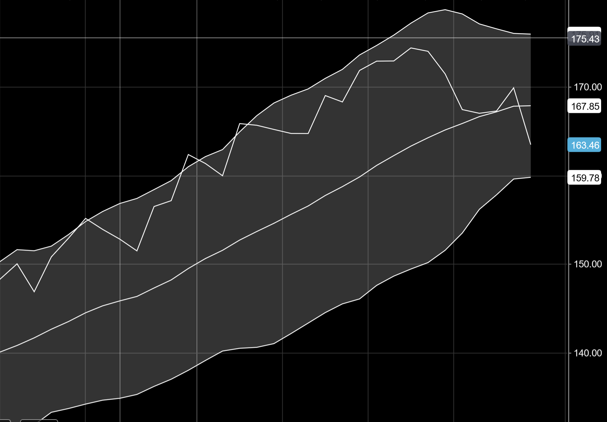
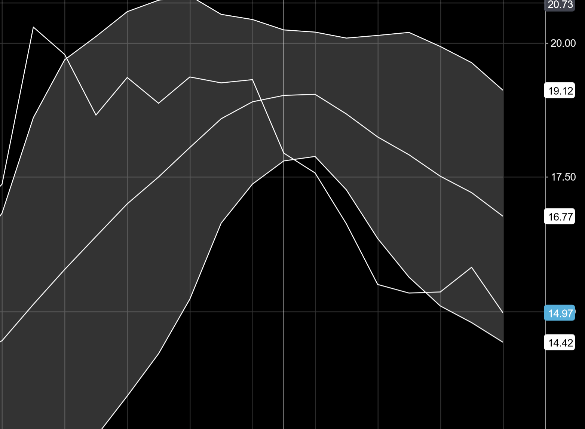
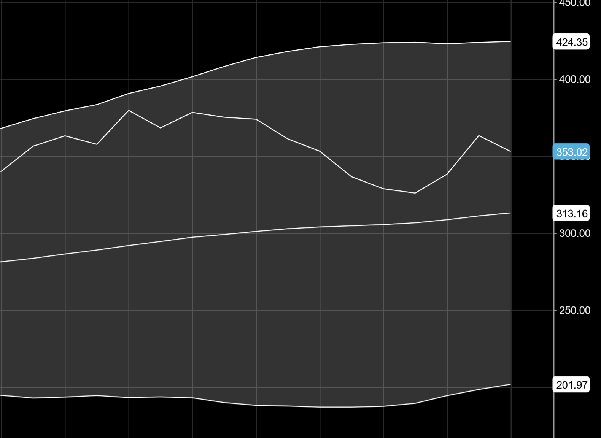

# FinBERT & LSTM-based Tech Stocks Trading Assistant Web App  

## Introduction  

  This project is a simple Streamlit **stock trading assistant** web-app, which includes **3 tools** that can help a trader have more accurate and profitable trades.  
You can try our app here: [App Link in HugginFace Spaces](https://huggingface.co/spaces/IoannisTr/Tech_Stocks_Trading_Assistant)  
An overview of this dashboard-like web app can be seen in the following figure:  
 
  
 
The app-assistant consists of 3 parts-tools:  
1. Stock Headers' of www.marketwatch.com articles sentiment analysis (FinBERT model) 
2. 7-day stock price prediction (LSTM model)
3. Outlooks of four different technical analysis methods for stock trading 
 
When the user chooses a stock from the app's drop-down menu, each of these 3 "tools" will return their "advice"/outlook.  

## FinBERT-based Sentiment Analysis (1st tool)
The 1st tool is the Sentiment Analysis lineplot. When the user chooses a stock, our code scraps the last 17 articles' headlines of this stock from www.marketwatch.com and labels them as either "Positive", "Negative", or "Neutral", which are encoded as scores (+100, 0, -100 correspondingly). As there is no standard way to quantify the sentiment of something, we will use a scale of (-100, +100). It must be noted that even though we get the last 17 articles' headers in each execution, only the last 12 headers' sentiment can be seen in the plot. That is because we use a rolling average with a sliding window of size 5, in order to "smooth" the line.  
 
The model used can be found here: [HuggingFace ProsusAI finbert](https://huggingface.co/ProsusAI/finbert)  
This model is a pre-trained NLP model that can analyze sentiment of financial text and it is built by further training the BERT language model in financial text.  
 
Additionaly, the model was fine-tuned by using the following dataset: [Financial PhraseBank (2014)](https://huggingface.co/datasets/financial_phrasebank).  
This dataset includes 4840 headlines-like sentences about financial news, labeled as either **Positive** or **Negative** or **Neutral**.  
 
After training the model, we save the weights in **.bin** file and reuse them each time we want to classify a headline. After the 17 "scraped" headlines are classified, they "get" a score of either *+100, 0, or -100*, and the rolling average of them is "printed" in the lineplot. 
When this line is mostly "negative" (below 0), we expect that most of the last articles have a negative sentiment, when they are mostly positive (above 0), we expect that there are many articles with positive sentiment, while when the line is close to 0, or revolves around it with no specific trend, we expect mixed outlook articles. 
 

`Interpretation for traders`  
 
Many recent negative news may lead to stock price decline, which means that the stock now is cheaper than it was recently, and the explanations are the following: 

* Either the bad news are minor and temporary, so the stock will soon recover (Often a :+1: **Buy Signal**)  
* Or the bad news are major and non-temporary, so the stock price may decline even more (Often a :-1: **Sell Signal**)  
 

Many recent positive news may lead to stock price increase which means that the stock now is more expensive than it was recently, and the explanations are the following:  

* Either the good news are minor and temporary, so the stock will soon drop back to it's usuall price soon (Often a :-1: **Sell Signal**)  
* Or the good news are major and non-temporary, so the stock price may increase even more in the next days or hours (Often a :+1: **Buy Signal**)  
 

## LSTM model for 7 days stock price prediction (2nd tool)
The second tool is an LSTM model that uses historical data of adjusted stock prices of a chosen stock (data for last 2 years), and predicts the stock price for the next 7 days. The output of these predictions can be seen in a time-series plot (lower-right side of dashboard).  
 
The data are acquired by **yfinance** library [yfinance Documentation](https://pypi.org/project/yfinance/) that gets data from Yahoo's API.  
It must be noted that **yfinance** returns us the following fields:  
1. **Date**: The date in which the record corresponds to
2. **Open**: The stock's opening price of the day
3. **High**: The stock's highest price of the day
4. **Low**: The stock's lowest price of the day
5. **Close**: The stock's closing price of the day
6. **Adj Close**: The stock's closing price of the day, **adjusted to stock's splits, dividends, and other corporate actions**  

 
In our analysis, we will use the "Adj Close" price only.  

It is notable that no model weights need to be saved, and in each stock selection from the user, the data acquistion and model training happen **on the go**.  

At last, some model arguments (like batch_size, etc.) are manually set for each stock specifically, in order to ensure as high **R-squared** scores as possible. 
 
`Interpretation for traders`  

* Upwards projection could be a potential :+1: **Buy Signal** (especially for large R-squared scores, which can be seen in the logs)  
* Downwards projectios could be a potential :-1: **Sell Signal** (especially for large R-squared scores, which can be seen in the logs)  
 

## Technical Analysis Methods (3rd tool) 

This set of methods are out of the scope of the course but they were added because we believe that they can be used supplementary with the previous 2 tools.  
Technical Analysis Methods are **Statistical Methods** for stock trading which usually use price rolling averages and standard deviations, in order to return their outlook (e.g. Buy, or Hold, or Sell). These methods usually belong to one of the following trading timeframes:
* **Short term trading** (Buying and Selling Stocks within hours,minutes or even seconds)
* **Medium term trading** (Buying and Selling Stocks within days or weeks)
* **Long term trading** (Buying and Selling Stocks within months)
 
To use the following methods, we have to get the realtime stock price when the NYSE and NASDAQ are open. To do so we "scrap" the current price from www.marketwatch.com  

### 1st method: Bollinger Bands of 20 days and 2 standard deviations
 

This method relies on 3 lines: 
* the 1st one is the 20 day rolling average of the stock price
* the 2nd one is the 20 day rolling average + 2 standard deviations (Upper Limit)
* the 3rd one is the 20 day rolling average - 2 standard deviation (Lower Limit)  

and is a "Medium-term" trading method (days or weeks)

`Interpretations for traders`

* When a stocks current price is between the rolling avg. and the Upper Limit, it is considered as **Overbought** (which is a 👎 **Sell Signal**)
* When a stocks current price is between the rolling avg and the Lower Limit it is considered as **Oversold** (which is a 👍 **Buy signal**)
* When a stocks current price is equal to the rolling average, it is considered as neither **Overbought** or **Oversold**, (which is a :fist: **Hold Signal**)
* When a stocks current price is higher than the upper limit or lower than the lower limit, it is considered as **Unusuall Event** (which signals :exclamation: **Caution**) 
 
*In the following figure, we can see that Apple's stock is considered as a "Buy" currently, according to the Bollinger Bands of 20 days and 2 st. deviations:*
  
 

### 2nd method: Bollinger Bands of 10 days and 1.5 standard deviations 
 

This method relies on 3 lines: 
* the 1st one is the 10 day rolling average of the stock price
* the 2nd one is the 10 day rolling average +1.5 standard deviations (Upper Limit)
* the 3rd one is the 10 day rolling average -1.5 standard deviation (Lower Limit)  

and is a "Short-term" trading method (hours, minutes or even seconds)

`Interpretations for traders`

* When a stocks current price is between the rolling avg. and the Upper Limit, it is considered as **Overbought** (which is a 👎 **Sell Signal**)
* When a stocks current price is between the rolling avg and the Lower Limit it is considered as **Oversold** (which is a 👍 **Buy signal**)
* When a stocks current price is equal to the rolling average, it is considered as neither **Overbought** or **Oversold**, (which is a :fist: **Hold Signal**)
* When a stocks current price is higher than the upper limit or lower than the lower limit, it is considered as **Unusuall Event** (which signals :exclamation: **Caution**) 
 
*In the following figure, we can see that Lyft's stock is considered as a "Buy" currently, according to the Bollinger Bands of 10 days and 1.5 st. deviations:*
  
 

### 3rd method: Bollinger Bands of 50 days and 3 standard deviations 
 

This method relies on 3 lines: 
* the 1st one is the 50 day rolling average of the stock price
* the 2nd one is the 50 day rolling average +3 standard deviations (Upper Limit)
* the 3rd one is the 50 day rolling average -3 standard deviation (Lower Limit)  

and is a "Long-term" trading method (weeks)

`Interpretations for traders`

* When a stocks current price is between the rolling avg. and the Upper Limit, it is considered as **Overbought** (which is a 👎 **Sell Signal**)
* When a stocks current price is between the rolling avg and the Lower Limit it is considered as **Oversold** (which is a 👍 **Buy signal**)
* When a stocks current price is equal to the rolling average, it is considered as neither **Overbought** or **Oversold**, (which is a :fist: **Hold Signal**)
* When a stocks current price is higher than the upper limit or lower than the lower limit, it is considered as **Unusuall Event** (which signals :exclamation: **Caution**) 
 
*In the following figure, we can see that MongoDB's stock is considered as a "Sell" currently, according to the Bollinger Bands of 50 days and 3 st. deviations:*
  
 

### 4th method: Moving Average Convergence Divergence (MACD)
 
MACD is a trend following momentum indicator based on 2 lines:  
* The 1st one is the difference between the 26-day exponential moving average (EMA) and the 12-day EMA (usually called **White Line**)  
* The 2nd one is the 9-day EMA (usually called **Red Line**)  

`Interpretations for traders`

* When **White Line** > **Red Line** the stock is considered to have a **Downtrend and No Signal** outlook (which is a 👎 **Sell Signal**)

* When **White Line** < **Red Line** the stock is considered to have a **Uptrend and No Signal** (which is a 👍 **Buy signal**)

* When **White Line** > **Red Line** and the former crossed the latter from upwards today or yesterday, the stock's outlook is **Downtrend and Sell** (which is a 👎 **Sell Signal**)

* When **White Line** < **Red Line** and the former crossed the latter from downwards today or yesterday, the stock's outlook is **Uptrend and Buy** (which is a 👍 **Buy signal**)
